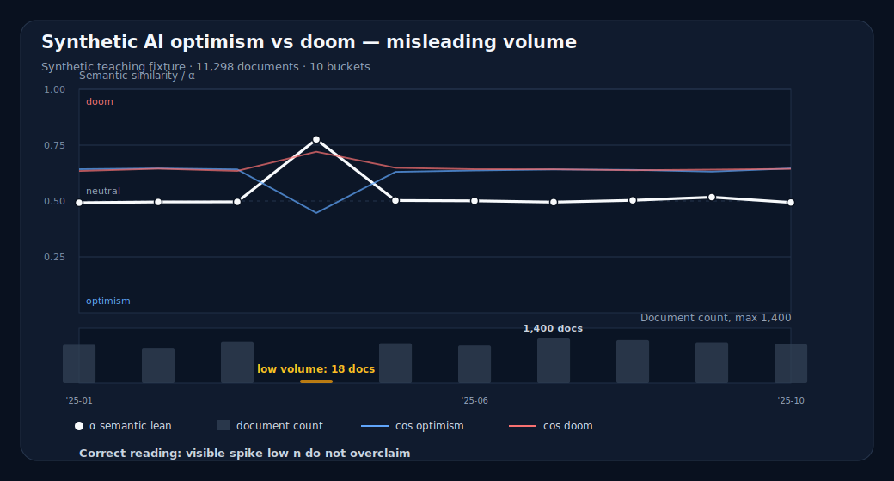

# Semantic Analysis 101

A teaching repo for reading semantic trend graphs without hallucinating a thesis from a line.

Semantic analysis can be useful. It can also produce a very clean chart that quietly outruns the evidence. This repo is a beginner guide for understanding Semantic Axis-style reports: what the lines mean, what the bars mean, what a trend can support, and what should make you lower confidence.

## The one-sentence version

A semantic trend graph is not a fact about the world. It is a measurement of how a text corpus relates to chosen semantic poles over time.

So the first question is never:

> What does the line say?

The first question is:

> What data, poles, bucket size, and document counts produced this line?

## Start here

Read these in order:

1. [What a semantic trend graph is](docs/lessons/01-what-is-a-semantic-trend.md)
2. [How to read alpha, cosine scores, buckets, and document counts](docs/lessons/02-how-to-read-the-graph.md)
3. [Four teaching datasets](docs/lessons/03-four-teaching-datasets.md)
4. [Common interpretation failures](docs/lessons/04-common-failures.md)
5. [Checklist before quoting a semantic trend](docs/checklists/before-quoting.md)
6. [Chart Interpretation Quiz](docs/game/index.html) — a small multiple-choice game using the four synthetic charts.

## Four example graphs

These graphs are generated from synthetic fixtures with answer keys. They are teaching examples, not claims about real AI discourse.

### 1. Clean-room phase shift


Correct reading:

> The synthetic corpus clearly shifts from optimism to neutral to doom.

Use this to learn the basic graph anatomy. If someone cannot read this one, the interface is failing at table stakes.

Live Semax report:

https://semax.memeticsresearch.com/?report=synthetic-ai-optimism-vs-doom-fa2d137a

### 2. Misleading low-volume spike



Correct reading:

> There is a dramatic spike, but it is based on only 18 documents. Do not quote it without the volume caveat.

This is the abuse test. If document counts are not inside the chart, someone can crop away the warning and post the spike. The market has enough magic tricks.

Live Semax report:

https://semax.memeticsresearch.com/?report=synthetic-ai-optimism-vs-doom-misleading-volume-dac3686c

### 3. Null / shuffled data


Correct reading:

> No meaningful semantic drift is present.

Use this to catch narrative manufacture. Humans are fully capable of seeing a story in noise; the graph should not help.

Live Semax report:

https://semax.memeticsresearch.com/?report=synthetic-ai-optimism-vs-doom-null-shuffled-327d8ba7

### 4. Close-margin / high-correlation data


Correct reading:

> Both semantic poles are high. The difference is small. Do not claim a strong lean.

This is the subtle one. A normalized line can make tiny differences look more meaningful than they are.

Live Semax report:

https://semax.memeticsresearch.com/?report=synthetic-ai-optimism-vs-doom-close-margin-39f711c4

## What the graph elements mean

- **Concept terms**: the thing being measured, such as `AI` or `artificial intelligence`.
- **Pole A terms**: one side of the semantic contrast, such as `optimism / hope / progress`.
- **Pole B terms**: the other side, such as `doom / risk / danger`.
- **Cosine to A / B**: embedding similarity between the concept and each pole.
- **Alpha (α)**: normalized position between the two poles. In these examples, lower alpha means closer to optimism; higher alpha means closer to doom.
- **Buckets**: time windows, such as months or quarters.
- **Document counts**: how many texts were measured in each bucket.

## The three most important warnings

1. **Low document count can create fake drama.**
   A spike based on 18 documents should not be treated like a shift based on 1,200 documents.

2. **Close margins are not strong claims.**
   If both poles are high and the difference is tiny, the honest conclusion is weak.

3. **A graph can be screenshot out of context.**
   The chart itself should carry the corpus, date range, bucket size, and evidence volume. If the warning can be cropped away, it was not really part of the evidence.

## Repo layout

```text
data/                 # synthetic fixtures used in the examples
docs/assets/          # generated SVG graphs
docs/lessons/         # 101 teaching guide
docs/cases/           # one-page interpretations of each dataset
docs/checklists/      # quote/review checklists
scripts/              # chart rendering scripts
tests/                # checks that docs and charts stay wired together
```

## Regenerate the graphs

```bash
python3 scripts/render_svg_charts.py
```

## Run checks

```bash
python3 -m pytest tests -q
```

## Relationship to Semax View Experiments

The source experiment harness lives here:

https://github.com/leo-guinan/semax-view-experiments

This repo is the teaching layer. The experiment repo asks, “Which views do people interpret correctly?” This repo teaches, “Here is how to interpret the views without fooling yourself.”

Both are necessary. Sadly.
