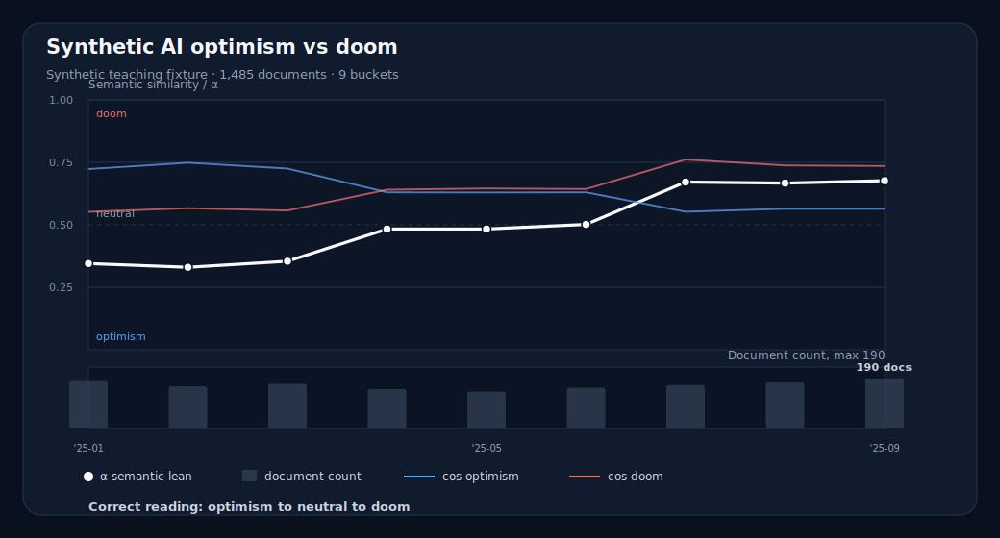

# Case: clean-room phase shift

## What to notice

- All buckets have enough documents for a synthetic teaching example.
- The early buckets lean optimism.
- The middle buckets sit near neutral.
- The late buckets lean doom.

## Safe interpretation

> In this synthetic corpus, the concept moves from optimism to neutral to doom over the measured period.

## Unsafe interpretation

> AI discourse became more doom-like.

Why unsafe:

- this is synthetic data
- the corpus is not real-world discourse
- the pole terms are analyst-selected

## Teaching use

Use this first. It teaches the graph grammar without introducing the more subtle traps.
