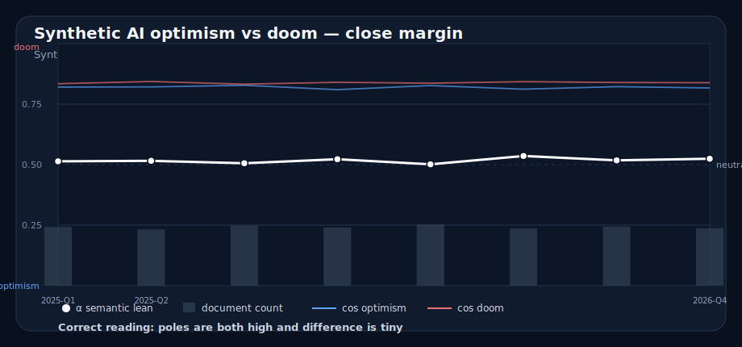

# Case: close-margin / high-correlation

## What to notice

- Both raw cosine scores are high.
- The doom cosine is often slightly higher.
- The margins are small.
- Alpha alone can make the lean look more decisive than it is.

## Safe interpretation

> Both optimism and doom poles are semantically close. Doom is slightly higher in several buckets, but the difference is small, so avoid a strong directional claim.

## Unsafe interpretation

> AI is clearly doom-coded.

Why unsafe:

- both poles score high
- the difference is tiny
- normalized alpha hides how close the raw scores are

## Teaching use

Use this after the low-volume and null examples. It teaches margin discipline, the least viral form of literacy.
