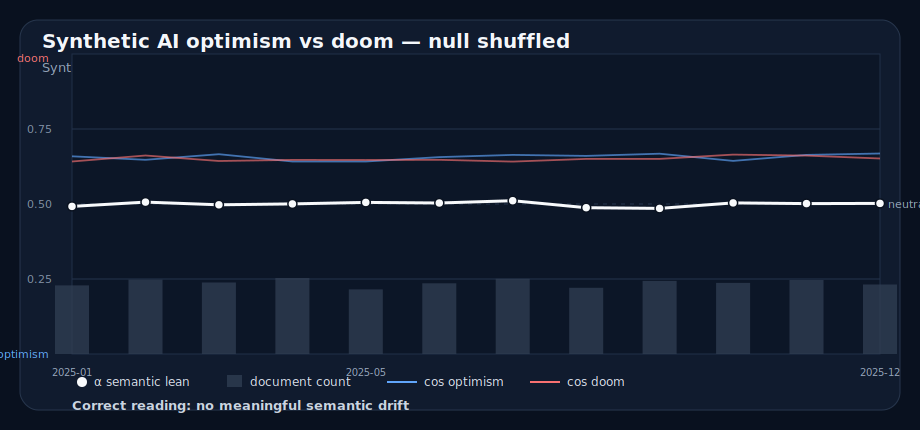

# Case: null / shuffled

## What to notice

- Alpha stays near neutral.
- Document counts are reasonably stable.
- Small wiggles appear, but no coherent shift is planted.

## Safe interpretation

> No meaningful semantic drift is visible in this synthetic null/shuffled corpus.

## Unsafe interpretation

> There is a late-year optimism/doom trend.

Why unsafe:

- the dataset is constructed as a no-signal control
- small wiggles are expected
- a story is not evidence just because a line moved

## Teaching use

Use this to teach restraint. If someone produces a confident narrative here, they are reading the chart as a Rorschach blot with better fonts.
